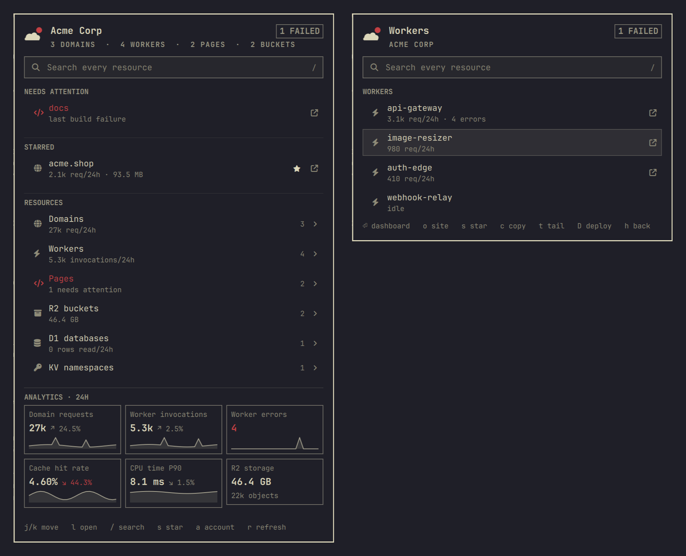

# Cloudflare for Omarchy

A bar widget for your Cloudflare account. Click it to see what is broken, what
it costs, and where each resource is. Open any resource in the dashboard, or go
straight to its live site.



## Install

```bash
omarchy plugin add https://github.com/meirdick/omarchy-cloudflare.git
omarchy plugin enable mdick.cloudflare
```

To remove it: `omarchy plugin remove mdick.cloudflare`.

The plugin is a git checkout. It installs nothing else. It has no install
scripts and does not use sudo.

## What you need

- `wrangler`, logged in with `wrangler login`.
- `curl`.
- `wl-copy`, for the copy keys.

You do not need an API token. The plugin uses the login wrangler already has.
That login can also read the analytics shown in the panel.

## What the panel shows

The panel opens on an overview:

| Section | What it shows |
|---|---|
| Search | A search box over every resource. Press `/` or click it. |
| Needs attention | Workers with too many errors, failed Pages builds, inactive domains. Shown only when something is wrong. |
| Starred | Resources you starred with `s`. |
| Resources | One row per type, with a count: Domains, Workers, Pages, R2, D1, KV, Queues. |
| Analytics | The last 24 hours, as on the Cloudflare analytics page. |
| Recent deploys | The last three deploys. |
| Shortcuts | Dashboard pages where you make API tokens. |

The analytics cards show:

- Domain requests
- Worker invocations
- Worker errors
- Cache hit rate
- CPU time P90
- R2 storage

Each card shows the value, the change from the 24 hours before (↗ or ↘), and a
line of the last 24 hours. A change in red is a change for the worse.

"Domain requests" counts traffic to your domains only. The dashboard's "Total
requests" also counts other traffic, so the two numbers can differ.

Open a resource type to see all of that type, busiest first. Starred items come
first.

Rows for sites have a ↗ button. It opens the live site. Clicking the row itself
opens the dashboard. A custom domain is used when there is one. A
`workers.dev` address is shown only if that route is turned on for the Worker,
so the button never leads to a 404.

## More than one account

If your login can see more than one account, press `a` to switch. The plugin
remembers your choice. You can also set `accountId` yourself (see Settings).

## Keys

| Key | Action |
|---|---|
| `j` / `k` | Move up and down |
| `l` or Enter | Open a type; on a resource, open it in the dashboard |
| `h` or Escape | Go back; on the overview, close the panel |
| `/` | Search |
| `o` | Open the live site |
| `s` | Star or unstar a resource |
| `a` | Switch account |
| `c` | Copy the resource ID |
| `u` | Copy the live address, or the dashboard link if there is no site |
| `r` | Refresh now |
| `t` | Show a Worker's live logs (`wrangler tail`) |
| `D` | Deploy a Worker or Pages project from its local folder |
| `R` | Roll back a Worker |
| `P` | Purge a domain's cache |
| Tab | Go to the next panel in the bar |

`D`, `R` and `P` ask you to confirm first. Deploy and roll back run in a
terminal window, so you can see the output and stop them.

Mouse: left click opens the panel. Right click refreshes. Middle click opens
the Workers page in the dashboard.

## Settings

Settings go in this widget's entry in `~/.config/omarchy/shell.json`:

```jsonc
{ "id": "mdick.cloudflare", "refreshIntervalSec": 60, "r2StorageGb": 500 }
```

| Setting | Default | What it does |
|---|---|---|
| `accountId` | first account | Which account to show. `a` sets this for you. |
| `refreshIntervalSec` | 60 | How often to load resources and deploys. |
| `analyticsIntervalSec` | 900 | How often to load analytics. |
| `projectsRoot` | `~/Projects` | Where to look for wrangler projects, for deploy and roll back. |
| `deployRows` | 8 | Deploys shown in a type view. |
| `overviewDeployRows` | 3 | Deploys shown on the overview. |
| `workerRequestsPerDay` | 0 | Your daily Worker allowance. Adds a bar to the invocations card. |
| `r2StorageGb` | 0 | Your R2 allowance in GB. Adds a bar to the R2 card. |
| `d1RowsReadPerDay` | 0 | Your daily D1 read allowance. Shown on the D1 row. |
| `errorRatePercent` | 1 | A Worker above this error rate needs attention. |
| `wranglerConfigPath` | found | Path to wrangler's login file, if it is not in the usual place. |

An allowance of 0 means "not set". The plugin does not guess your plan, so it
shows no percentage until you set one. A card turns red at 90%.

The widget also writes `starred` (your stars) and `accountId` (when you press
`a`) into the same entry. It writes nothing else, and only when you ask.

## What does not work

- **Cache purge.** The wrangler login cannot purge caches. `P` tells you so.
  Make an API token with the Cache Purge permission if you need it.
- **Deploy and roll back** need a local copy of the project under
  `projectsRoot`. Without one, the plugin says so and does nothing.

## Privacy

Your token is sent to `curl` on its standard input, not on the command line.
Other programs on your computer can read command lines, but not standard input.

The preview image uses made-up data.

## Development

```bash
node --test test/
```

The tests run `Model.js` against the files in `fixtures/`. The fixtures are
made up.

Files:

| File | Purpose |
|---|---|
| `Panel.qml` | Bar icon, panel, keys, rows, analytics cards |
| `Service.qml` | Login, account, loading data, actions |
| `Model.js` | Builds the rows and cards. No Qt, so node can test it. |
| `Api.js` | Cloudflare URLs, the analytics query, curl settings |
| `CloudflareIcon.qml` | The bar icon |

`omarchy-shell mdick.cloudflare diagnose` prints the widget's state as JSON:
login, account, counts, the last error, and the panel's position on screen.

Things to know:

- Changes to `.js` files need `omarchy-restart-shell`. Only `.qml` files reload
  on save.
- If the widget does not appear, the error is in the shell log:
  `quickshell list --all`, then `quickshell log -i <instance> -t 100`.
- Check that a Nerd Font glyph exists before you use it. A missing glyph draws
  as a different character.
- To make a preview image, fill the panel with made-up data, then capture only
  the panel: `grim -g` with the `card` values from `diagnose`.

## Listing

Listed on [plugins.omarchy.org](https://plugins.omarchy.org/plugin.html?id=mdick.cloudflare)
under Developer Tools.

## License

MIT
